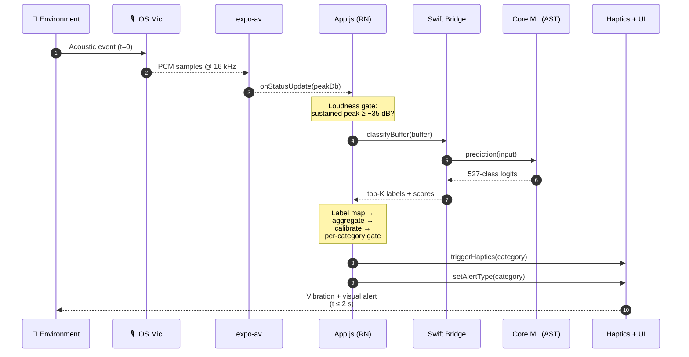

<!-- Banner -->
<p align="center">
  
</p>

<h1 align="center">VibeCheck</h1>

<p align="center">
  <b>On-device sound awareness for Deaf and Hard-of-Hearing users.</b><br/>
  Real-time environmental sound detection → distinct haptic patterns → high-contrast visual alerts.
</p>

<!-- Badges -->
<p align="center">
  
  
  
  
  
  
  
  
</p>

---

## 📌 Overview

**VibeCheck** is a mobile application that helps individuals who are Deaf or Hard-of-Hearing (DHH) stay aware of critical sounds in their environment — smoke alarms, doorbells, knocking, baby crying, sirens, appliance alerts, and more — by translating them into **distinct vibration patterns** and **high-contrast visual alerts**.

All classification happens **entirely on-device** using a Core ML build of the [Audio Spectrogram Transformer (AST)](https://huggingface.co/MIT/ast-finetuned-audioset-10-10-0.4593) fine-tuned on Google's AudioSet (527 classes). Nothing leaves your phone. No account. No cloud. No recording to disk.

### Who is this for?

- 🦻 **DHH users** who want safety alerts that travel with them (home, work, travel) without dedicated hardware like bed-shakers or strobe boxes.
- 🎧 **Situationally impaired users** — factory workers in hearing protection, commuters with noise-cancelling headphones, new parents trying to sleep through everything *except* the baby.
- 🧑‍💻 **Researchers and accessibility developers** interested in an open reference implementation of an on-device audio-classification assistive app.

### Why it exists

Existing solutions are fragmented. Platform features (Apple Sound Recognition, Android Sound Notifications) have fixed category sets and minimal customization. Hardware alert devices (Sonic Alert, etc.) are effective but stationary and expensive. Nothing delivers **portable, cross-platform, fully customizable, privacy-preserving** environmental sound awareness in a single app. VibeCheck is that app.

---

## 📚 Table of Contents

- [Overview](#-overview)
- [Quickstart](#-quickstart)
- [Features](#-features)
- [Architecture](#-architecture)
  - [Diagram 1 — System Architecture (Conceptual)](#diagram-1--system-architecture-conceptual)
  - [Diagram 2 — Runtime Sequence (Per-Alert Data Flow)](#diagram-2--runtime-sequence-per-alert-data-flow)
- [Usage Examples](#-usage-examples)
- [Supported Sound Categories](#-supported-sound-categories)
- [Demo GIFs](#-demo-gifs)
- [Dependencies](#-dependencies)
- [FAQ](#-faq)
- [Contributing](#-contributing)
- [Acknowledgements](#-acknowledgements)
- [License](#-license)

---

## ⚡ Quickstart

> 🎞️ **[GIF PLACEHOLDER #1 — `assets/quickstart.gif`]**
> *A ~15–20 second screen recording of a Mac terminal + phone side-by-side showing: (1) `git clone` succeeding, (2) `cd VibeCheckApp && npm install` scrolling quickly, (3) `npx expo run:ios --device` booting, (4) the VibeCheck splash screen fading into the onboarding Welcome step on the iPhone. Captured at 1080p, exported at 720p 15fps to keep the file under 8 MB. Alt-text: "Terminal running git clone, npm install, and expo run:ios, followed by the VibeCheck app launching on an iPhone."*

### Prerequisites

| Requirement        | Version      | Notes                                                                 |
| ------------------ | ------------ | --------------------------------------------------------------------- |
| macOS              | 13+          | Required for Xcode / iOS builds                                       |
| Xcode              | 15+          | Install from the Mac App Store                                        |
| Node.js            | 18 LTS or 20 | `brew install node@20`                                                |
| npm                | 9+           | Ships with Node                                                       |
| Expo CLI           | latest       | `npm install -g expo-cli` (optional; `npx expo` works without it)     |
| CocoaPods          | 1.15+        | `sudo gem install cocoapods`                                          |
| **Git LFS**        | 3.x          | **Required** — the 166 MB Core ML model is stored via LFS             |
| iPhone (recommended) | iOS 15+    | Microphone access + haptics are limited on the simulator              |

### Installation

```bash
# 1. Install Git LFS BEFORE cloning (so the Core ML weights download correctly)
brew install git-lfs
git lfs install

# 2. Clone the repo
git clone https://github.com/<your-org>/VibeCheck.git
cd VibeCheck/VibeCheckApp

# 3. Verify the Core ML weights downloaded as a real binary, not an LFS pointer stub
# Expected size: ~166 MB
ls -lh ios/VibeCheckNative/ASTClassifier.mlpackage/Data/com.apple.CoreML/weights/weight.bin

# 4. Install JS and native dependencies
npm install
cd ios && pod install && cd ..

# 5. Run on a connected iPhone (recommended) or simulator
npx expo run:ios --device        # plug in your iPhone and select it
# or
npx expo run:ios                 # iOS simulator (mic access is limited)
```

> ⚠️ **If `weight.bin` is only a few hundred bytes**, Git LFS is not set up correctly. Run `git lfs install` and `git lfs pull`, then rebuild.

### First-run checklist

1. Grant **microphone permission** when iOS prompts you.
2. Complete onboarding (Welcome → Mic → Categories → Test Vibration).
3. Tap a manual trigger tile on the Home screen to confirm the alert UI + haptics work.
4. Play a smoke-alarm audio clip from a speaker near the phone to verify live detection.

---

## 🚀 Features

### 🔊 Real-time on-device sound classification
A native Swift module wraps a **166 MB Core ML build of AST** (Audio Spectrogram Transformer, 527-class AudioSet). Audio buffers from `expo-av` are passed to Core ML and scored against a label map that aggregates the 527 raw classes into 12 user-facing categories. Inference runs on Apple's Neural Engine; typical end-to-end latency (sound onset → full-screen alert) is **well under 2 seconds**.

### 📳 Distinct haptic patterns per category
Each sound category maps to a **unique Tacton-inspired vibration pattern** — varying in pulse count, duration, and inter-pulse gap — designed so users can identify the alert type from the vibration alone. For example, the smoke-alarm pattern is rapid long bursts that auto-repeat; doorbell is two medium pulses; knocking is three short taps.

### 🎯 Accurate detection with dual gating
To suppress false positives, every candidate alert must clear **two independent gates**:
- **Loudness gate** — peak dB + sustained-sample count above threshold, so background TV audio doesn't trigger alerts.
- **Confidence gate** — calibrated Core ML score ≥ per-category minimum (0.70 global default, looser for diffuse sounds like thunder).

### 🧠 Smart silence handling
AST's "Silence" class is broad and often ranks #1 even during real events in quiet rooms. VibeCheck's **lenient silence override** checks the runner-up category and, if the environment is acoustically loud and the #2 is a meaningful non-silence class, fires the alert anyway.

### ⚙️ Full user configurability
- Enable or disable any of the 12 sound categories independently.
- Preview haptic patterns per category with a "Test Vibration" button.
- Adjust detection sensitivity (Low / Medium / High) — each maps to a different dB threshold.
- All preferences persist across app launches via `AsyncStorage`.

### 🔐 Privacy-first by architecture
- **Zero network calls in the audio pipeline.** The model is bundled in the app binary and runs on-device.
- **No audio written to persistent storage.** Buffers are processed in memory and released.
- **Explicit microphone-permission disclosure** in onboarding and a persistent in-app "Listening…" status indicator.

### 📜 Event history with full timestamps
Every detected event is logged locally with a full date/time, reviewable from the History tab. This directly addresses the DHH research finding that users want to verify what the system caught when they weren't looking.

### 🎨 WCAG 2.1 AA accessible UI
All alert screens use dark backgrounds with high-contrast accent colors paired with **distinct emoji icons**, so no information is communicated by color alone. Touch targets meet the 44×44 pt iOS minimum.

---

## 🏛️ Architecture

VibeCheck ships with **two architecture diagrams** that together give you both the high-level product view and the runtime implementation view.

### Diagram 1 — System Architecture (Conceptual)

<p align="center">
  
</p>

**What this diagram shows.** This is the **conceptual system architecture** — a product-level view of the pipeline from raw microphone input to a haptic alert on the user's wrist or phone. It is intentionally framework-agnostic so that it stays valid whether the ML backend is AST on Core ML (current iOS build) or YAMNet on TensorFlow Lite (planned Android build).

**Reading guide (top row, left → right).**

1. **Audio Capture.** The iOS microphone is opened via Expo AV. Audio is sampled at 16 kHz mono — the rate AST expects — and streamed into an in-memory rolling buffer. A live dB meter on the Home screen gives the user continuous feedback that monitoring is active.
2. **Audio Processing.** The buffer is sliced into fixed-length windows (~10 s for AST inference; shorter for metering). Feature extraction happens inside the Core ML model (AST produces its own mel-spectrogram internally), so this stage is mostly framing and pre-emphasis in our build. The diagram names MFCC / Log-Mel as representative feature types for clarity.
3. **Sound Classification (ML Model).** The on-device classifier ingests the processed window and returns a probability vector over 527 AudioSet classes. This is the most compute-intensive stage and runs on the Neural Engine on A12+ iPhones.
4. **Alert Mapping.** Raw AudioSet scores are aggregated into 12 user-facing categories via a **priority-ordered label map** (keyword-matching with collision handling — e.g. "Baby laughter" resolves to Baby Crying, not Laughter, because of iteration order). Scores are calibrated into a 0.60–0.99 confidence range. If a category clears its dual gate (loudness + confidence), it becomes the alert.
5. **Vibration Output.** The alert category is handed to a haptic dispatcher (Expo Haptics on iOS) that plays the category's unique Tacton pattern. The high-contrast visual overlay is rendered in parallel. The diagram includes a paired smartwatch as a stretch-goal relay target.

**Supporting services (middle row).** Settings & Customization owns enable/disable toggles, per-category vibration preview, and the sensitivity slider. Local Storage is AsyncStorage — small JSON blobs for preferences and the history log, all on-device. Privacy & Security is an explicit architectural lane, not a feature: it encodes the invariant that no audio leaves the device at any stage.

**How to use this diagram.** Use this view when you want to understand *what* the system does and *which layer* owns a given behavior. It's what you'd show a PM, a new teammate, or a user research participant.

### Diagram 2 — Runtime Sequence (Per-Alert Data Flow)

> 🖼️ **[DIAGRAM PLACEHOLDER #2 — `assets/architecture-sequence.png`]**
>
> **What this diagram should be.** A UML-style **sequence diagram** that complements Diagram 1 by showing the precise runtime interactions between layers for **a single alert event**, from acoustic onset to haptic output. Where Diagram 1 is a static product view, Diagram 2 is a dynamic engineering view that makes the 2-second latency budget visible.
>
> **How to build it.** Use [Excalidraw](https://excalidraw.com/), [Mermaid](https://mermaid.js.org/syntax/sequenceDiagram.html), or [Lucidchart](https://www.lucidchart.com/). A Mermaid starter is embedded below so the diagram renders inline on GitHub; export a PNG version too for the image placeholder.
>
> **Swim-lanes / participants (left → right):**
> 1. **User's Environment** — emits the acoustic event (e.g., smoke alarm chirp).
> 2. **iOS Microphone** — hardware layer, samples at 16 kHz.
> 3. **`expo-av` (JS)** — opens the recorder, emits buffer and metering callbacks.
> 4. **`App.js` (React Native)** — holds the rolling buffer, the dB gate, and the call site for classification.
> 5. **`SoundClassifierBridge.m` / `SoundClassifier.swift`** — the native iOS module that receives buffers from JS and invokes Core ML.
> 6. **`ASTClassifier.mlpackage` (Core ML)** — the on-device Neural-Engine inference target.
> 7. **Post-processing (`App.js`)** — label map, aggregation, calibration, per-category gates.
> 8. **Haptic Engine (`expo-haptics`) + UI (Alert Modal)** — the output layer.
>
> **Required messages / arrows (top → bottom):**
>
> | # | From → To | Message | Annotation |
> |---|-----------|---------|------------|
> | 1 | Environment → Microphone | acoustic event | t = 0 |
> | 2 | Microphone → expo-av | PCM samples (16 kHz) | streaming |
> | 3 | expo-av → App.js | `onStatusUpdate(metering)` | ~every 100 ms |
> | 4 | App.js → App.js | append to rolling buffer, compute peak dB, sustained-loud count | |
> | 5 | App.js → Bridge | `classifyBuffer(buffer)` | only fires when loudness gate clears |
> | 6 | Bridge → SoundClassifier.swift | forward as `Float32` array | |
> | 7 | SoundClassifier → Core ML | `prediction(input: spectrogramInput)` | Neural Engine executes AST |
> | 8 | Core ML → SoundClassifier | 527-class logit vector | ~200–400 ms wall time |
> | 9 | SoundClassifier → Bridge → App.js | top-K labels + scores (JSON-serializable) | |
> | 10 | App.js → App.js | label-map lookup, score aggregation, calibration, dual-gate check | |
> | 11 | App.js → Haptic Engine | `triggerHaptics(category, pattern)` | if gate passes |
> | 12 | App.js → UI | `setAlertType(category)` → full-screen overlay renders | same frame |
> | 13 | UI → User | high-contrast visual + vibration pattern | t ≤ 2 s (R1 target) |
>
> **Visual requirements:** vertical lifelines for all 8 participants, horizontal arrows for each message, dashed return arrows for synchronous replies (steps 8 and 9), time annotations on the right-hand edge at steps 1, 7, 9, and 13. Use consistent colors from the brand palette (teal #26C6DA for data, violet #8A2BE2 for ML, amber #FFB300 for control).
>
> **Why a second diagram?** The conceptual diagram hides *where the latency budget is spent* and *which layer enforces privacy*. The sequence diagram answers both — it makes the ~200–400 ms ML step visible, shows that the Core ML call is the only compute-heavy step, and proves visually that no arrow ever leaves the device boundary.

A quick Mermaid version that renders inline on GitHub while the full designed PNG is being authored:



---

## 📱 Usage Examples

### Example 1 — Smoke alarm while cooking

> 🎞️ **[GIF PLACEHOLDER #2 — `assets/alert-detection.gif`]**
> *A 10–12 second screen recording (phone screen mirrored via QuickTime) showing: the Home screen with the live dB meter quiet → a smoke-alarm clip plays from an off-screen Bluetooth speaker → the dB meter spikes red → within ~1–2 seconds the full-screen red Smoke Alarm takeover appears (🚨 emoji, "SMOKE ALARM" text, timestamp) while the phone vibrates audibly → user taps Dismiss → new entry appears at the top of "Recent detections." Annotate with a small "~1.6s end-to-end" caption near the alert. 720p, 15fps, target file size ≤ 6 MB. Alt-text: "iPhone screen showing VibeCheck detecting a smoke alarm and triggering a full-screen red alert with haptic vibration in under two seconds."*

**What to notice**
- The live dB meter flips red as soon as the acoustic event crosses the detection threshold.
- The alert modal takes over the full screen — no need for the user to look for a notification banner.
- Critical-priority alerts like Smoke Alarm use a **repeating** haptic until dismissed.
- The event is logged in history with a full timestamp.

### Example 2 — Customizing which sounds to monitor

> 🎞️ **[GIF PLACEHOLDER #3 — `assets/customization.gif`]**
> *An 8–10 second clip of the Preferences tab. Show the user: (1) toggling off Microwave, (2) toggling on Thunder, (3) tapping "Test Vibration" on the Doorbell row and the phone vibrating, (4) changing sensitivity from Medium to Low. Alt-text: "VibeCheck Preferences screen, user toggles categories on and off, previews a haptic pattern, and changes the sensitivity setting."*

**Code-level behavior.** Preferences are persisted via `AsyncStorage`, keyed by category ID:

```js
// simplified from App.js
await AsyncStorage.setItem(
  '@vibecheck/preferences',
  JSON.stringify({
    enabled: { smokeAlarm: true, doorbell: true, microwave: false, /* ... */ },
    sensitivity: 'low',
    version: 2,
  })
);
```

On the next app launch, preferences hydrate before the microphone starts listening — so a user's settings survive reboots, app updates, and even device migration (via iCloud app data backup).

### Example 3 — Manually triggering an alert (for demos or practice)

Every sound tile on the Home screen doubles as a manual trigger for demo and testing purposes. Tap any tile to fire the alert UI and haptic without needing a real acoustic event. Useful when you want to teach a new user which vibration pattern means which sound.

---

## 🔊 Supported Sound Categories

| Category            | Priority | Default | Typical use case                                   |
| ------------------- | -------- | ------- | -------------------------------------------------- |
| 🚨 Smoke Alarm       | Critical | ON      | Fire / CO detector chirp                           |
| 🔔 Doorbell          | High     | ON      | Doorbell ring, chime, buzzer                       |
| ✊ Knocking          | High     | ON      | Door knock, rap on wood                            |
| 👶 Baby Crying       | High     | ON      | Infant crying or fussing                           |
| 🚓 Emergency Siren   | High     | ON      | Police / ambulance / fire engine siren             |
| 📻 Microwave         | Medium   | ON      | Microwave finish beep                              |
| 📞 Phone Ringing     | Medium   | ON      | Landline / cell ringtone in environment            |
| 🚗 Car Horn          | Medium   | ON      | Road safety, parking situations                    |
| ⛈️ Thunder           | Medium   | ON      | Storm awareness, weather cue                       |
| 💧 Running Water     | Low      | ON      | Faucet left on, tub overflowing, sink              |
| 🚙 Vehicle Engine    | Low      | OFF     | Approaching car / motorcycle (opt-in)              |
| 😂 Laughter          | Low      | OFF     | Social awareness (opt-in)                          |

Additional categories in the label map (intruder sounds, dog bark, cat meow, gunshot, shouting) are gated behind opt-in toggles for advanced users.

---

## 🎬 Demo GIFs

All GIFs live under [`assets/`](assets/). Placeholders above describe exactly what each recording should show. The minimum set is three:

| File                          | Purpose                                        | Target length | Appears in         |
| ----------------------------- | ---------------------------------------------- | ------------- | ------------------ |
| `assets/quickstart.gif`       | Terminal install + first launch                | 15–20 s       | Quickstart         |
| `assets/alert-detection.gif`  | Live smoke-alarm detection + haptic            | 10–12 s       | Usage Example 1    |
| `assets/customization.gif`    | Preferences: toggles, test vibration, slider   | 8–10 s        | Usage Example 2    |

**How to record them.** Use QuickTime on macOS with "New Movie Recording" set to the iPhone as both video and audio source (works over USB-C). Trim and crop in Premiere Pro or iMovie, then export as GIF via [Gifski](https://gif.ski/) for the best size-to-quality ratio. Target ≤ 8 MB per GIF so they load quickly on GitHub.

---

## 📦 Dependencies

Core runtime dependencies (see [`package.json`](package.json) for exact pinned versions):

```jsonc
{
  "expo": "~54.0.0",                              // Expo SDK + dev tooling
  "react": "19.1.0",
  "react-native": "0.81.5",
  "expo-av": "~16.0.8",                           // microphone + audio capture
  "expo-audio": "~1.1.1",
  "expo-haptics": "~15.0.8",                      // Core Haptics on iOS
  "expo-file-system": "~19.0.21",
  "expo-status-bar": "~3.0.9",
  "react-native-safe-area-context": "~5.6.0",
  "@react-native-async-storage/async-storage": "2.2.0"
}
```

Native iOS (in `ios/VibeCheckNative/`):

- `SoundClassifier.swift` — Core ML wrapper around the AST model.
- `SoundClassifierBridge.m` — Objective-C bridge exposing the Swift class to React Native.
- `ASTClassifier.mlpackage` — the 166 MB compiled Core ML model (stored via **Git LFS**).
- `ast_labels.json` — the 527 AudioSet class labels.

External systems:

- **Git LFS** for distributing the Core ML weight blob past GitHub's 100 MB per-file limit.
- **CocoaPods** for the native iOS dependency graph (`pod install` after clone).

---

## ❓ FAQ

<details>
<summary><b>Does VibeCheck record audio?</b></summary>

No. The microphone stream is processed in memory and discarded. No audio buffer is ever written to disk, uploaded, or retained beyond the current classification window. The only persistent record of a detected event is a short category label and timestamp in the local history log.
</details>

<details>
<summary><b>Does the app work without internet?</b></summary>

Yes, completely. The Core ML model is bundled in the app binary at install time. After the initial install, VibeCheck never makes a network call for audio processing — it would keep working in airplane mode or on a plane.
</details>

<details>
<summary><b>What sounds can VibeCheck detect?</b></summary>

The current iOS build ships with 12 user-facing categories (see the [Supported Sound Categories](#-supported-sound-categories) table above). Under the hood, the AST model scores all 527 AudioSet classes, which means the label map can be extended to cover many more categories (glass breaking, alarm clock, car backing up, etc.) without retraining the model.
</details>

<details>
<summary><b>Does it work in noisy environments?</b></summary>

Detection accuracy degrades gracefully with ambient noise. Our design target (requirement R2 in the URD) is ≥ 85% true-positive rate at 55 dB moderate indoor noise. For very loud environments, switching sensitivity to **High** in Preferences lowers the detection-dB floor so quieter target sounds still trigger.
</details>

<details>
<summary><b>Can I customize the vibration patterns?</b></summary>

You can enable or disable any category and preview its built-in pattern from Preferences. Authoring custom patterns per category is a planned feature — the scaffolding is in place (`HAPTIC_PATTERNS` is a plain JS object in `App.js`), and a UI for editing patterns is in the roadmap.
</details>

<details>
<summary><b>Why does the simulator not pick up real sounds?</b></summary>

The iOS Simulator's microphone access is limited and routes through the host Mac, so classification in the simulator is unreliable. **Use a physical iPhone for real testing.** Run with `npx expo run:ios --device` and select your plugged-in iPhone.
</details>

<details>
<summary><b>I cloned the repo but the app crashes on launch with a Core ML loading error.</b></summary>

Most likely the Core ML model didn't download correctly via Git LFS. Check:

```bash
ls -lh ios/VibeCheckNative/ASTClassifier.mlpackage/Data/com.apple.CoreML/weights/weight.bin
# Expected: ~166M
# If you see a few hundred bytes, run:
git lfs install && git lfs pull
```

Then `cd ios && pod install && cd ..` and rebuild.
</details>

<details>
<summary><b>What about Android?</b></summary>

The current production build is iOS-only because AST runs beautifully on Apple's Neural Engine via Core ML. Android support is on the roadmap using TensorFlow Lite + YAMNet (the original plan in the URD). The React Native UI layer is already cross-platform; only the native classification module would need a TFLite-backed Android implementation.
</details>

<details>
<summary><b>How does VibeCheck compare to Apple Sound Recognition?</b></summary>

Apple Sound Recognition detects ~14 fixed categories and delivers a standard iOS notification. VibeCheck detects a user-extendable set (the AST model scores 527 categories), delivers **category-specific haptic patterns** rather than a generic vibration, provides a persistent event history, and uses a full-screen high-contrast alert designed for DHH users rather than a notification banner. VibeCheck is complementary to Apple Sound Recognition — you can run both.
</details>

<details>
<summary><b>Is my audio data ever sent to a server?</b></summary>

No. There are no outbound audio-related network calls anywhere in the codebase. Every audio buffer stays on the device and is released after the classification window closes. This is a hard architectural invariant, not a configurable option.
</details>

---

## 🤝 Contributing

Contributions are welcome. A few ways to help:

1. **Report a bug or request a feature.** Open an issue with a clear reproduction or a concrete use case.
2. **Improve label-map coverage.** The AST model can classify many more categories than we currently surface. A PR adding a well-tested category (with the correct keyword list and false-positive calibration) is a great first contribution.
3. **Android port.** We'd love help wiring up the TensorFlow Lite / YAMNet backend for Android.

### Development workflow

```bash
# fork the repo, then:
git clone https://github.com/<your-username>/VibeCheck.git
cd VibeCheck/VibeCheckApp
git checkout -b feat/your-feature-name

# make your changes, then:
git add .
git commit -m "feat: short description"
git push origin feat/your-feature-name
```

Open a pull request against `main` with a clear description of the change and any test steps. Before pushing, please:

- Make sure `npx expo run:ios` still builds cleanly.
- Avoid committing generated files (`ios/build/`, `ios/Pods/`, `.DS_Store`).
- **Never** commit `weight.bin` as a regular blob — always through Git LFS.

---

## 🙌 Acknowledgements

- **MIT CSAIL** for releasing the [AST: Audio Spectrogram Transformer](https://huggingface.co/MIT/ast-finetuned-audioset-10-10-0.4593) model under an open license.
- **Google** for [AudioSet](https://research.google.com/audioset/), the 527-class ontology that underpins VibeCheck's classification.
- **The DHH research community** — specifically the findings in Bragg et al. (2019), Brewster & Brown (Tactons, 2004), and Hoggan, Brewster & Johnston (CHI 2008) — which informed our haptic and trust design decisions.
- **Apple's Core ML and Core Haptics teams** for building an inference runtime and haptic API that make on-device assistive audio actually feasible on a phone.
- **The Expo and React Native communities** for the cross-platform tooling that lets three undergrads ship a real iOS app in a single semester.
- **Our EECS 497 instructors and classmates** for feedback across four major deliverables (Concept → Planning → Requirements → Testing).

**Team.** Nauman Siddiqui (`nsidd`) · Mohid Durrani (`mohidd`) · Timothy Johns (`twjohns`)
**Course.** EECS 497: Human-Centered Software Design and Development, Winter 2026, University of Michigan.

---

## 📄 License

Released under the [MIT License](LICENSE). You may use, modify, and distribute this software freely. The AST model weights are covered by their [original MIT license](https://github.com/YuanGongND/ast). AudioSet labels are © Google, released under CC BY 4.0.
