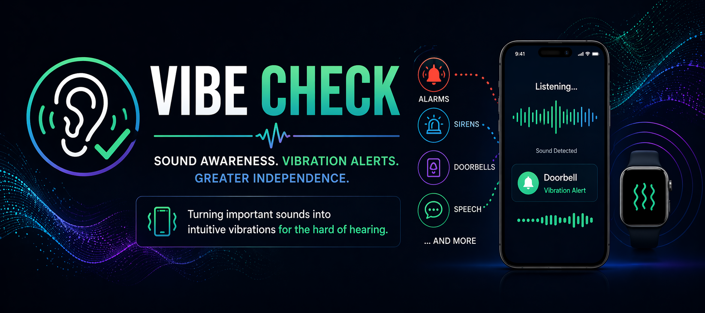
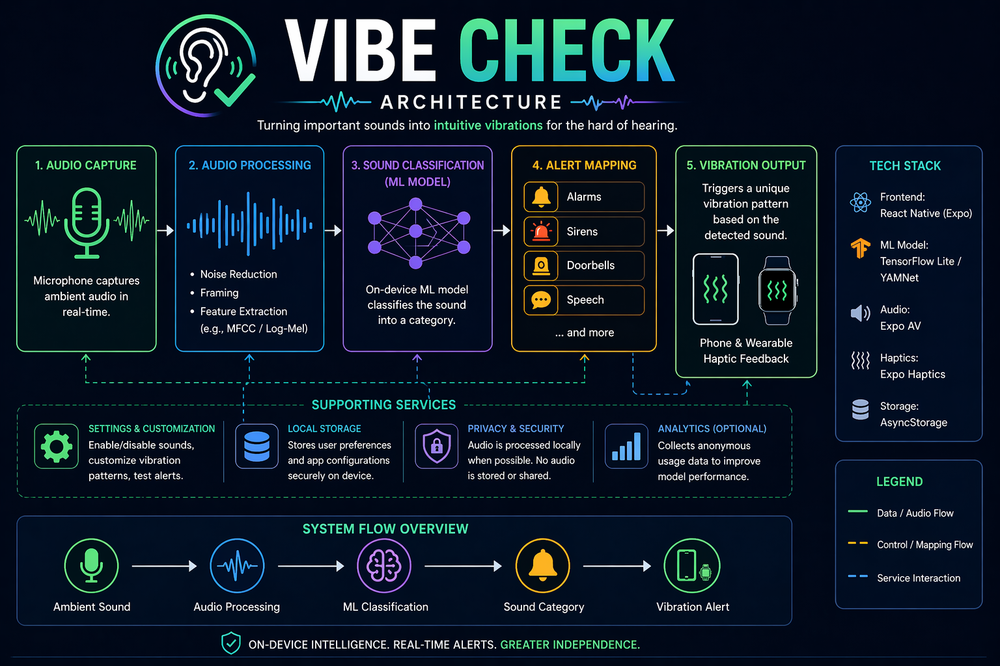

📌 Overview

VibeCheck is a mobile application designed to help individuals who are hard of hearing detect important environmental sounds using vibration feedback. The app uses machine learning to recognize sounds like alarms, sirens, doorbells, and speech, and translates them into distinct vibration patterns.

This allows users to stay aware of their surroundings without relying on sound, improving both safety and independence.

📚 Table of Contents
Overview
Quickstart
Features
Architecture
Usage
FAQ
Dependencies
Contributing
Acknowledgements
⚡ Quickstart
Prerequisites
Node.js (v18+)
npm or yarn
Expo CLI
npm install -g expo-cli
Installation
git clone https://github.com/your-repo/vibecheck.git
cd vibecheck
npm install
Run the App
npx expo start

Then:

Press i for iOS simulator
Press a for Android emulator
Or scan QR code with Expo Go
🎬 App Startup Demo (GIF)

🚀 Features
🔊 Real-Time Sound Detection

Uses a machine learning classifier to detect environmental sounds continuously.

📳 Vibration Feedback System

Each sound maps to a unique vibration pattern so users can differentiate alerts.

⚙️ Customizable Alerts

Users can:

Enable/disable sound categories
Customize vibration patterns
🔒 Privacy-Focused
Audio processed locally when possible
No recordings stored without consent

🧠 Architecture:

Flow:

Microphone captures audio
Audio is processed into features
ML model classifies sound (e.g., alarm, speech)
App triggers corresponding vibration pattern
📱 Usage
Example: Detecting a Doorbell
Open the app
Enable "Doorbell Detection"
When detected → phone vibrates in a short repeating pattern
🎬 Feature Demo (GIF)

❓ FAQ
Q: Does the app record audio?

No. Audio is processed in real time and not stored unless explicitly allowed.

Q: What sounds can it detect?
Alarms
Sirens
Doorbells
Speech (basic detection)
Q: Does it work in noisy environments?

Performance may vary, but models are trained to handle moderate background noise.

Q: Can I customize vibrations?

Yes — each sound can have a unique vibration pattern.

📦 Dependencies
React Native (Expo)
TensorFlow Lite / YAMNet (planned)
Expo Haptics API
Node.js
🤝 Contributing
Fork the repo
Create a feature branch
Commit your changes
Open a pull request
🙌 Acknowledgements
TensorFlow Audio Models (YAMNet)
Expo Team
Accessibility design inspiration from real-world hearing assistance tools
📎 Notes
Add your GIFs to /assets:
startup.gif
feature.gif
Add your architecture diagram as architecture.png
Replace repo link before submitting
